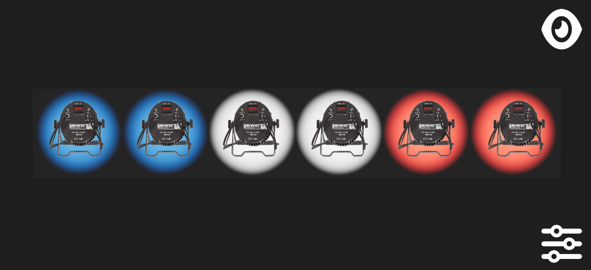
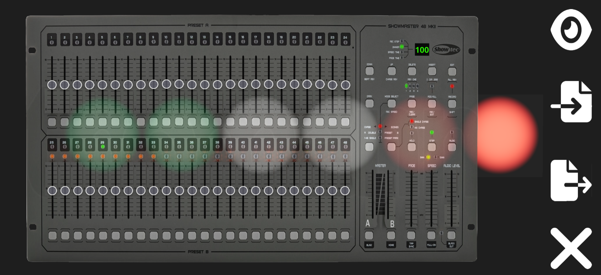

<a name="readme-head">

    <h1 id="readme-title">Light Bridge</h1>
    <h4 id="readme-description">Étude de cas Interactive du Rapport de P.F.M.P PFL Events 13/11/2023 au 22/12/2023 de AMAND Alexandre Contrôle d’un Pont Lumière à l’aide d’une Console DMX en Temps Réel avec Configuration de Scènes Personnalisables</h4>
    
    
    
    
    
    
    
    
    
    
    
    
    
    
    
    
    
    
    
    

</a>
<a name="readme-body">

</a>
<a name="readme-footer">
CL 2024 <a id="readme-footer-repo" href="https://github.com/AmandAlexandrePro/Light-Bridge">Light Bridge</a> &lt;/&gt; avec ❤ par <a id="readme-footer-author" href="https://github.com/AmandAlexandrePro">AMAND Alexandre</a> et les <a id="readme-footer-contributors" href="https://github.com/AmandAlexandrePro/Light-Bridge/graphs/contributors">contributeurs</a>.
</a>
